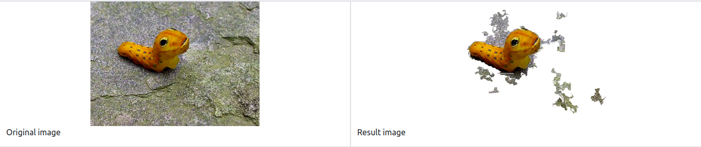

A deployment for DRFI model. Choose your image and it will help you to crop the most salient object in scene.

1. Prerequisite

- Create an environment with virtualenv:

    ```bash
    virtualenv drfi-flask -p python3
    ```

    This command will create a virtual enviroment with name drfi-flask and python3 for default python.

- Activate your environment:

    ```bash
    source drfi-flask/bin/activate
    ```

- Install all libraries with pip:

    ```bash
    pip install -r requirements.txt
    ```

- Create folder for model data and result

  ```bash
  mkdir data\model data\result
  ```

2.  Load your trained model:

- Download pretrained model from this [link](https://drive.google.com/drive/folders/1wCoi5mTWR1RclgQMpRpdx2J7tYeoh5oU?usp=sharing), then copy it to data/model folder.

3.  Run your server:

Notice: You need to activate your environment before start your server.

```bash
python server.py
```

or

```bash
flask run
```

Your server will be started at port 5000, go to localhost:5000 to see the homepage.

3. Run an inference: Choose your photo and submit.

4. Example:


